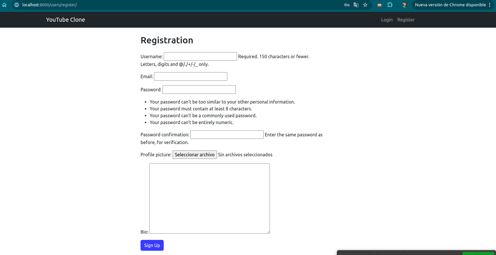
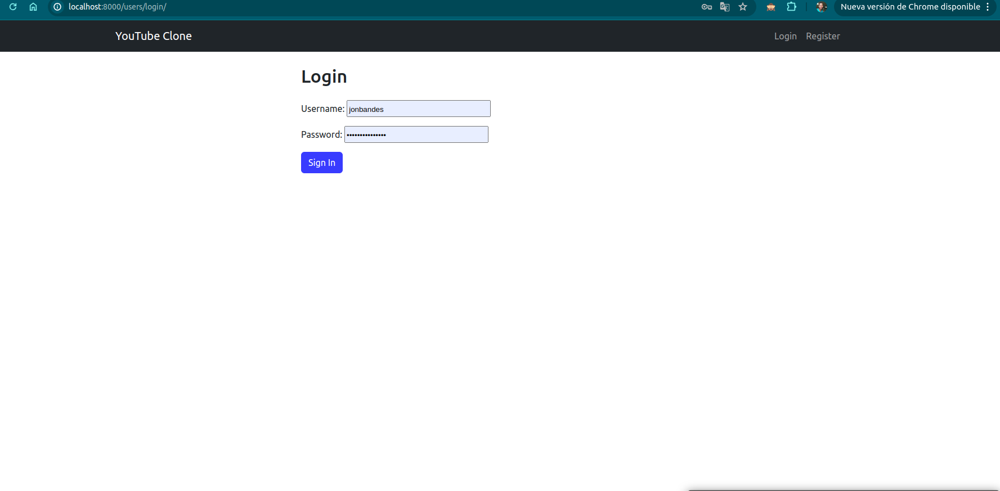
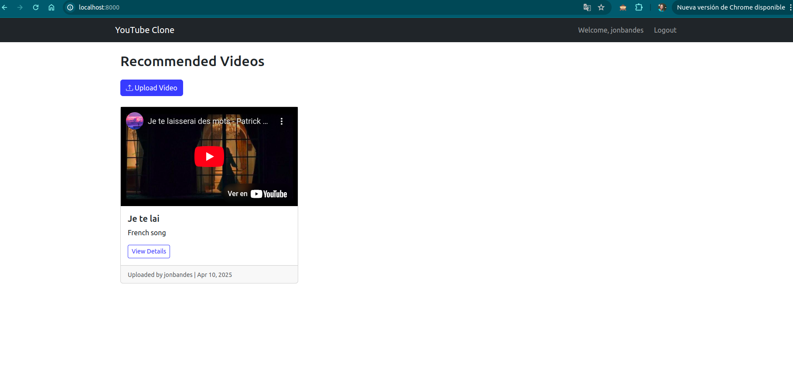
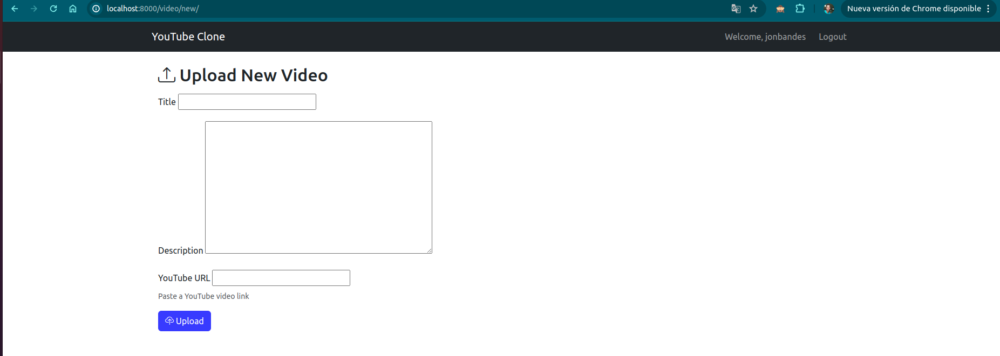
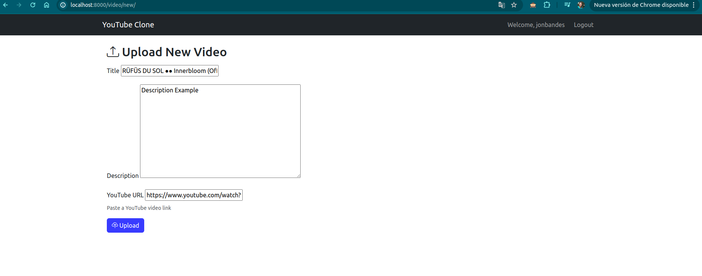
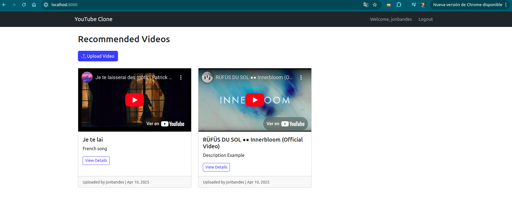
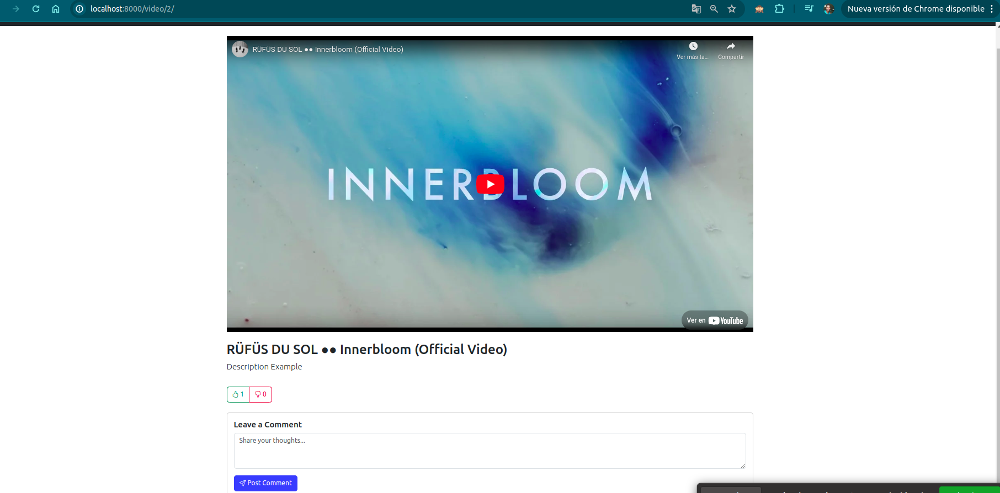
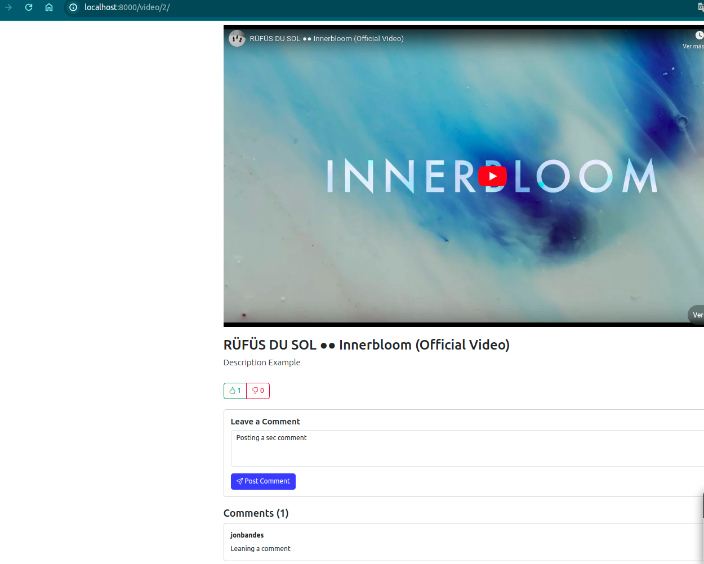
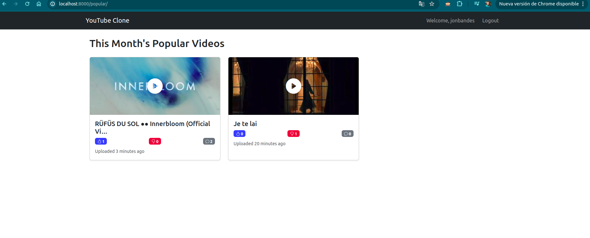

# YouTube Clone 🎥

[](https://www.djangoproject.com/)
[](https://getbootstrap.com/)

A feature-rich YouTube clone built with Django that allows users to upload, share, and interact with videos.

 <!-- Add your screenshot later -->













## Features ✨

### Core Functionality
- ✅ User authentication (Register/Login/Logout)
- 📹 YouTube video embedding via URL
- 👍👎 Like/Dislike system with AJAX
- 💬 Commenting system
- 🏆 Popular videos algorithm

### Technical Highlights
- Custom user model with profile pictures
- Dynamic popularity scoring system
- Responsive Bootstrap 5 design
- CSRF-protected AJAX requests
- Efficient database queries

## Installation 🛠️

### Prerequisites
- Python 3.9+
- PostgreSQL (recommended) or SQLite

### Setup
```bash
# Clone the repository
git clone https://github.com/yourusername/youtube-clone.git
cd youtube-clone

# Create virtual environment
python3 -m venv venv
source venv/bin/activate  # On Windows: venv\Scripts\activate

# Install dependencies
pip install -r requirements.txt

# Configure environment variables
cp .env.example .env
# Edit .env with your settings

# Apply migrations
python3 manage.py makemigrations
python3 manage.py migrate

# Create superuser
python3 manage.py createsuperuser

# Run development server
python3 manage.py runserver

Project Structure 📂
Copy
youtube-clone/
├── core/               # Django project settings
├── users/              # User authentication app
│   ├── models.py       # Custom user model
│   ├── forms.py        # Registration forms
│   └── ...
├── videos/             # Core functionality app
│   ├── models.py       # Video & Comment models
│   ├── views.py        # All business logic
│   └── ...
├── templates/          # HTML templates
├── static/             # Static files
└── manage.py

API Endpoints 🌐
Endpoint	            Method	Description
/video/<id>/like/	    POST	Like a video (AJAX)
/video/<id>/dislike/	POST	Dislike a video (AJAX)